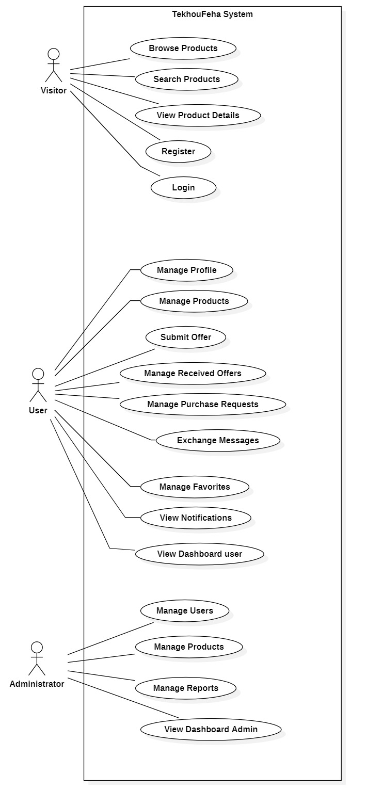

# Use Case Diagram

## Overview

The following diagram presents the global use case diagram of the TekhouFeha platform.

---

## Actors

- Visitor
- User
- Administrator

---

## Description

### Visitor

The Visitor can:

- Browse products
- Search products
- View product details
- Register
- Login

### User

The User can:

- Manage profile
- Manage products
- Submit offers
- Manage received offers
- Manage purchase requests
- Chat
- Manage favorites
- View notifications
- Access the user dashboard

### Administrator

The Administrator can:

- Manage users
- Manage products
- Manage reports
- Access the admin dashboard

---

## Notes

This diagram provides